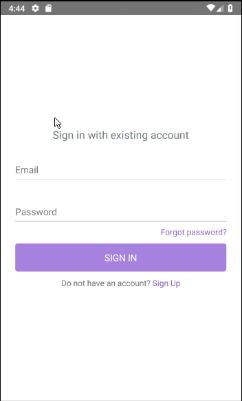

# React Native starter

[](https://github.com/paralect/stack)

[](#contributors)
[](LICENSE)
[](http://makeapullrequest.com)
[](https://app.bitrise.io/app/8c32e911da6c3ab7)
[](https://david-dm.org/paralect/react-native-starter)

[](https://github.com/paralect/react-native-starter/watchers)
[](https://github.com/paralect/react-native-starter/stargazers)
[](https://twitter.com/paralect)
[](https://twitter.com/intent/tweet?text=I%27m%20using%20Stack%20components%20to%20build%20my%20next%20product%20%F0%9F%9A%80.%20Check%20it%20out:%20https://github.com/paralect/stack)

React Native starter is what we think an ideal starting point for the most React Native applications. It is based on the following primary technologies:

- react
- react-native
- react-navigation
- redux
- eslint
- i18n

Application structured in a way, which we find most efficient in both short and long term projects. The main intention of the current structure is to keep logical components close to each other and define clear structure for the common things, such as navigation, store, api wrappers, reducers, action creators, store selectors.

## Start

#### 1. Clone and Install

```bash
# Clone the repo
git clone git@github.com:paralect/react-native-starter.git

# Install dependencies
yarn install
# or
npm install
```

#### 2. Start the app on the device or emulator

```bash
# start a development server
npm start

# run the app on device/emulator
npm run android
# or
npm run ios
```

### Explanations of the files structure.

1. **[android](./android)** - this folder contains all Android native code.
2. **[assets](./assets)** - this folder should contain static files: images, fonts, etc.
3. **[ios](./ios)** - this folder contains all iOS native code.
4. **[src](./src)** - this folder contains all custom code and related stuff: screens, components, navigation, styles, etc. This is the root folder of the project. All imports can be determined relative to `src`, e.g. `import configureStore from 'resources/store'`
    - **[src/helpers](./src/helpers)** - this folder should contain all app-wide standalone helper functions and services.
    - **[src/i18n](./src/i18n)** - this folder contains internationalization setup and locales.
    - **[src/navigation](./src/navigation)** - this folder contains all code related to setting up navigation between screens: navigators, headers, tab bars. etc.
    - **[src/resources](./src/resources)** - this folder consists of all redux/api related things. Typically resource maps 1 to 1 to the api endpoint, but not limited to only api endpoints. Every resource is responsible for management certain part of the redux store. If you need keep something client specific in the redux store, you can create separate resource for it. For example: navigation resource may contain some history of the all opened pages without 1 to 1 connection to the rest api. Main moving parts of resource:
        - **[src/resources/store.js](./src/resources/store.js)** - initialization logic for the redux store. Adds redux middlewares.
        - **[src/resources/reducer.js](./src/resources/reducer.js)** - combines all reducers.
        - **[src/resources/\*/\*.actions.js](./src/resources/user/user.actions.js)** - contains redux action creators for the given resource. Also here you can find validation schema created using [yup](https://github.com/jquense/yup) which is similar to the Joi schema validation.
        - **[src/resources/\*/\*.api.js](./src/resources/user/user.api.js)** - contains all api methods of the given resource. Optional.
        - **[src/resources/\*/\*.reducer.js](./src/resources/user/user.reducer.js)** - contains reducer for the given resource. All reducers combined together in the [reducer.js](./src/resources/reducer.js).
        - **[src/resource/\*/\*.selectors.js](./src/resources/user/user.selectors.js)** - contains selectors for the given resource. You should never access store directly, but always use selectors instead. That would simplify things when structure of the store data changes.
        - **[src/resource/\*/\*.constants.js](./src/resources/user/user.constants.js)** - contains constants related to the resource (e.g. action types).
    - **[src/screens](./src/screens)** - this folder contains screen folders. Main moving parts of this folder:
        - **[src/screens/\*/\*.jsx](./src/screens/homeScreen/homeScreen.jsx)** - the main file of every screen. Implements screen layout.
        - **[src/screens/\*/\*.styles.js](./src/screens/homeScreen/homeScreen.styles.js)** - this file contains all the styles for related screen.
        - **[src/screens/\*/index.js](./src/screens/homeScreen/index.js)** - index file which exports the default export from the related screen. Used to reduce the length of screen imports in other files.
        - **[src/screens/\*/components](./src/screens/homeScreen)** - this folder contains all the components related to this screen. Optional.
    - **[src/themes](./src/themes)** - this folder contains all assets exports.
    - **[src/components](./src/components)** - this folder contains all the components that are not related to a certain screen or used across different screens.
5. **[.env[.development/.staging]](.env)** - this files contains environment variables for every type of build. API_URL and similar variables are usually stored there.

### Conventions

1. Name of all files for components should start from lowercase letter and words should be separated by a dash (`date-range`, `multi-action-button`).
2. Code style (eslint).

### Additional tuning

1. If you need push notifications in your app you can set it up using [this guide](https://medium.com/@anum.amin/react-native-integrating-push-notifications-using-fcm-349fff071591) and then adjust it using [this comment](https://medium.com/@vagabondtt1503/thanks-for-the-helpful-article-76035c8e3a82). Also there are [examples of receiving notiications](https://rnfirebase.io/docs/v5.x.x/messaging/receiving-messages).
2. Android Studio may offer to update Gradle. It may break the app and cause crashes in release mode. The latest tested version of Gradle is already installed in this repo, so perform Gradle upgrading at your own risk.
3. In order to deploy the app using Bitrise you can use [this guide](https://devcenter.bitrise.io/getting-started/getting-started-with-react-native-apps/). [Here](https://gist.github.com/SobakaSlava/1c6867d4f7f7e6813fedc0125dd5d1ea) is a working example of Bitrise workflow yaml configuration.  

## Demo



## License

React Native starter is released under the [MIT License](LICENSE).

## Contributing

Please read [CONTRIBUTING.md](CONTRIBUTING.md) for details on our code of conduct, and the process for submitting pull requests to us.

Join us and share something developers need 👌.

## Contributors
Thanks goes to these wonderful people ([emoji key](https://github.com/kentcdodds/all-contributors#emoji-key)):

<!-- ALL-CONTRIBUTORS-LIST:START - Do not remove or modify this section -->
<!-- prettier-ignore -->
<table><tr><td align="center"><a href="https://github.com/SobakaSlava"><br /><sub><b>SobakaSlava</b></sub></a><br /><a href="https://github.com/paralect/react-native-starter/commits?author=SobakaSlava" title="Code">💻</a> <a href="https://github.com/paralect/react-native-starter/commits?author=SobakaSlava" title="Documentation">📖</a> <a href="#ideas-SobakaSlava" title="Ideas, Planning, & Feedback">🤔</a></td><td align="center"><a href="https://github.com/arlovaalina"><br /><sub><b>arlovaalina</b></sub></a><br /><a href="https://github.com/paralect/react-native-starter/commits?author=arlovaalina" title="Code">💻</a> <a href="#ideas-arlovaalina" title="Ideas, Planning, & Feedback">🤔</a></td><td align="center"><a href="https://github.com/IharKrasnik"><br /><sub><b>Ihar</b></sub></a><br /><a href="#ideas-IharKrasnik" title="Ideas, Planning, & Feedback">🤔</a> <a href="#review-IharKrasnik" title="Reviewed Pull Requests">👀</a></td><td align="center"><a href="https://github.com/hovoodd"><br /><sub><b>hovoodd</b></sub></a><br /><a href="#ideas-hovoodd" title="Ideas, Planning, & Feedback">🤔</a> <a href="#review-hovoodd" title="Reviewed Pull Requests">👀</a></td></tr></table>

<!-- ALL-CONTRIBUTORS-LIST:END -->

This project follows the [all-contributors](https://github.com/kentcdodds/all-contributors) specification. Contributions of any kind welcome!
